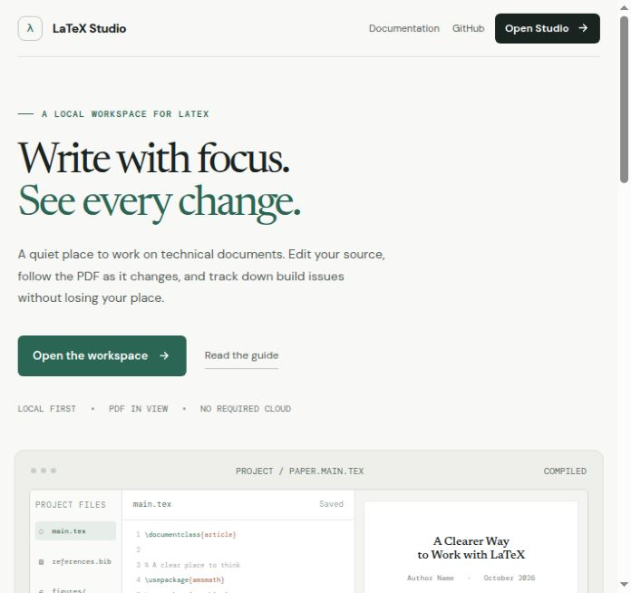

# LaTeX Studio

A local-first LaTeX workspace for writing, compiling, and reviewing documents in one focused interface.

LaTeX Studio combines a CodeMirror editor, live PDF preview, SyncTeX navigation, project-wide search, build diagnostics, project templates, and package checks. It runs on your machine and stores projects in its local `projects/` directory.




## Features

- Source, split, and PDF-focused workspace layouts
- pdfLaTeX, XeLaTeX, LuaLaTeX, and pLaTeX build selection
- Live preview, PDF navigation/search, and SyncTeX source jumps
- Project and file management, templates, ZIP import/export, and public GitHub repository import
- LaTeX package diagnostics and installation through TeX Live or MiKTeX when available
- BibTeX import and merge workflow for Zotero Better BibTeX exports
- Keyboard shortcuts, autocomplete, outline, symbols, and project-wide search/replace

## Requirements

- Node.js 18 or newer
- npm
- A TeX distribution for PDF compilation: TeX Live or MiKTeX

LaTeX Studio can start without a TeX distribution, but compilation and package installation will be unavailable. Install the TeX packages required by your documents through your distribution's package manager.

## Quick start

```sh
npm install
npm start
```

Open [http://localhost:4180](http://localhost:4180). The landing page links to the workspace at `/studio`. By default the server listens on `0.0.0.0:4180`; set `HOST=127.0.0.1` to limit access to the local machine, or set `PORT` to use another port.

### Cloudflare Pages

For Cloudflare Workers, run `npm ci && npm run deploy:cloudflare`. This builds the app, downloads the TeX Live 2025 WebAssembly runtime, splits its larger runtime files into Cloudflare-compatible static assets, then publishes the Worker and assets together. Runtime downloads total about 230 MB during deployment; visitors download the 31 MB compiler and only the package bundles their documents use. See [Cloudflare deployment](docs/CLOUDFLARE.md) for browser requirements, supported engines, and limits.

The deployed editor automatically uses a browser-local workspace backed by IndexedDB. Users can create and edit projects, files, and folders, search and replace text, import/export ZIP archives, and keep work across reloads in the same browser profile. **PDF compilation also works on the hosted domain**: pdfLaTeX and XeLaTeX run in WebAssembly inside the visitor's browser. Project sources and generated PDFs stay in that browser; the Worker only serves static app/compiler assets and byte ranges. Browser-local files are separate from files on the computer's filesystem; export a project ZIP to download a copy.

Use `npm start` for the full local Node.js workflow, including local TeX installations, LuaLaTeX, SyncTeX, system package diagnostics/installation, GitHub import, and Zotero/BibTeX merge tools.

## Documentation

- [User guide](docs/USER_GUIDE.md)
- [Integrations](docs/INTEGRATIONS.md)
- [Architecture](docs/ARCHITECTURE.md)
- [Security notes](docs/SECURITY.md)
- [Run and verify](RUNNING.md)

## Development

```sh
npm run build
npm run verify
npm run serve
```

`npm run verify` runs the repository's non-destructive application checks. It creates temporary uniquely named projects and removes them afterwards. It does not install TeX packages or prove that every document compiles on every TeX distribution.

## Data and privacy

Projects are stored locally under `projects/`. That directory is intentionally excluded from version control. GitHub import downloads a public repository archive into a new local project; it does not push changes back to GitHub. Zotero support uses BibTeX exports (including Better BibTeX) and does not require an account connection.

LaTeX Studio is published without a license declaration in this initial release. All rights are reserved by default; obtain permission before redistributing or reusing the code.
